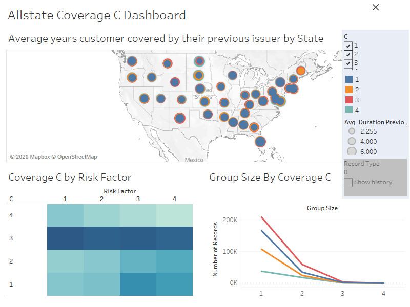

# Allstate-Purchase-Prediction
Analyzing history of car insurance quotes that each customer reviewed before making a purchase, the options they actually purchased, and data about the customer and their car to predict the the car insurance options purchased by individual customers 

[link to interactive dashboard](https://public.tableau.com/profile/cristian.t.lazaro#!/?newProfile=&activeTab=0)
( Modeling insurance conversion rate to increase from benchmark 50% to ~53% coming shortly)

# Business Goal
As a customer shops an insurance policy, he/she will receive a number of quotes with different coverage options before purchasing a plan. This is represented in this challenge as a series of rows that include a customer ID, information about the customer, information about the quoted policy, and the cost. Your task is to predict the purchased coverage options using a limited subset of the total interaction history. If the eventual purchase can be predicted sooner in the shopping window, the quoting process is shortened and the issuer is less likely to lose the customer's business.

# What is a customer?
Each customer has many shopping points, where a shopping point is defined by a customer with certain characteristics viewing a product and its associated cost at a particular time.
* Some customer characteristics may change over time (e.g. as the customer changes or provides new information), and the cost depends on both the product and the customer characteristics.
* A customer may represent a collection of people, as policies can cover more than one person.
* A customer may purchase a product that was not viewed!

# Variable Descriptions
* customer_ID - A unique identifier for the customer
* shopping_pt - Unique identifier for the shopping point of a given customer
* record_type - 0=shopping point, 1=purchase point
* day - Day of the week (0-6, 0=Monday)
* time - Time of day (HH:MM)
* state - State where shopping point occurred
* location - Location ID where shopping point occurred
* group_size - How many people will be covered under the policy (1, 2, 3 or 4)
* homeowner - Whether the customer owns a home or not (0=no, 1=yes)
* car_age - Age of the customer’s car
* car_value - How valuable was the customer’s car when new
* risk_factor - An ordinal assessment of how risky the customer is (1, 2, 3, 4)
* age_oldest - Age of the oldest person in customer's group
* age_youngest - Age of the youngest person in customer’s group
* married_couple - Does the customer group contain a married couple (0=no, 1=yes)
* C_previous - What the customer formerly had or currently has for product option C (0=nothing, 1, 2, 3,4)
* duration_previous -  how long (in years) the customer was covered by their previous issuer
* A,B,C,D,E,F,G - the coverage options
* cost - cost of the quoted coverage options

